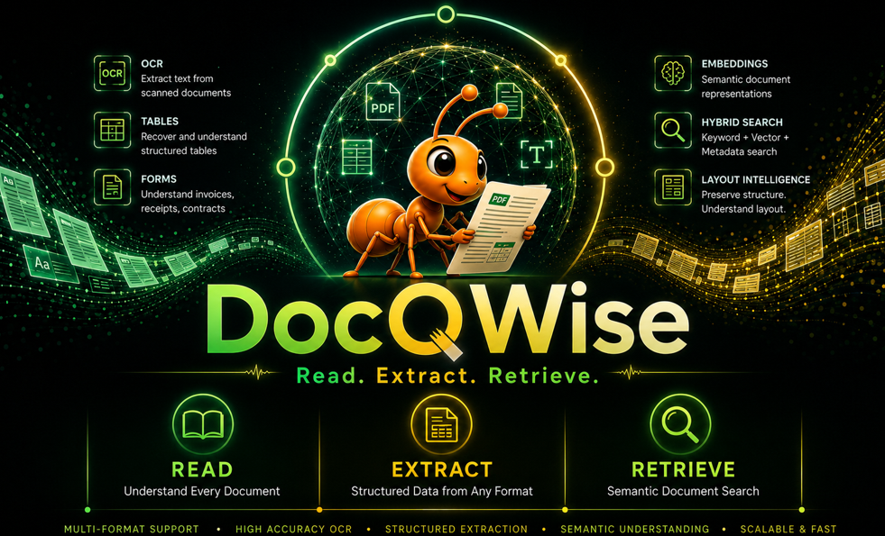

<p align="center">
  
</p>

<p align="center">
  <strong>Document intelligence that adapts, accelerates, and scales.</strong>
</p>

<p align="center">
  <a href="https://pypi.org/project/docqwise/"></a>
  <a href="https://github.com/VK-Ant/docqwise/blob/main/LICENSE"></a>
  <a href="https://github.com/VK-Ant/docqwise/blob/main/notebooks/docqwise_getting_started.ipynb">
        </a>
</p>

---

## What is DocQWise?

DocQWise is a pluggable, high-performance document intelligence engine for structured and unstructured data. Read any document format, extract exact structured data, and retrieve with semantic search : locally, at scale, for zero per-page cost.

**Not a parser. Not a framework. A platform in a library.**

## Key Features

- **Read anything** : PDF, DOCX, images, Excel, CSV, JSON, XML, databases, emails, presentations
- **Extract everything** : text, tables, fields, forms, entities, images, layout with bounding boxes
- **Pluggable everything** : bring your own OCR, vector DB, LLM, database, graph store
- **Speed-first** : multiprocessing, async I/O, GPU batching, batch processing
- **Incremental** : hash-based change detection, never reprocess unchanged files
- **Self-improving** : user corrections stored as exact overrides, applied automatically
- **Local-first** : zero cloud dependency, zero per-page cost, your data stays yours
- **Deterministic** : same input = same output, always

## Installation

```bash
# Core (PDF, DOCX, TXT, images, SQLite store)
pip install docqwise

# With ML models (OCR, layout, embeddings)
pip install docqwise[ml]

# Full processing (pandas, Excel, tables, BM25)
pip install docqwise[full]

# Cloud API connectors (OpenAI, Azure, AWS, Google)
pip install docqwise[api]

# Vector store connectors (Qdrant, FAISS, ChromaDB, pgvector)
pip install docqwise[connectors]

# GraphRAG (NetworkX, Neo4j, Kuzu)
pip install docqwise[graph]

# REST API server (FastAPI)
pip install docqwise[server]

# Everything
pip install docqwise[all]
```

## Docker

```bash
# Quick start
docker run -p 8000:8000 -v ./docs:/data vkant/docqwise:latest

# Docker Compose
docker compose up -d
```

## Quick Start

```python
from docqwise import Docqwise

dq = Docqwise()

# Ingest documents
dq.ingest("documents/")

# Semantic search
results = dq.retrieve("payment terms", top_k=5)

# Natural language Q&A
answer = dq.ask("What is the total amount?")

# Field extraction
fields = dq.extract_fields("invoice.pdf", template="invoice")

# Table extraction
tables = dq.extract_tables("report.pdf")
df = tables[0].to_dataframe()
```

## Extract from Any Source

```python
dq = Docqwise()

# Documents
dq.ingest("report.pdf")
dq.ingest("contract.docx")
dq.ingest("scan.tiff")

# Structured data
dq.ingest("data.csv")
dq.ingest("transactions.xlsx")

# Databases
dq.ingest("postgresql://host/db", tables=["invoices"])
dq.ingest("mongodb://host/db", collections=["contracts"])

# Cloud storage
dq.ingest("s3://bucket/documents/")

# Folders (auto-detect all formats)
dq.ingest("documents/")
```

## Field Extraction

```python
# Auto-detect fields
fields = dq.extract_fields("invoice.pdf")

# Schema-driven extraction
fields = dq.extract_fields("invoice.pdf", schema={
    "vendor_name": {"type": "string"},
    "total": {"type": "number"},
    "due_date": {"type": "date"},
    "line_items": {"type": "array"},
})

# Pre-built templates
fields = dq.extract_fields("invoice.pdf", template="invoice")
```

## Self-Improving Corrections

```python
result = dq.extract_fields("invoice.pdf", template="invoice")

# Fix a wrong field
result.correct({"tax": 1402.00, "po_number": "PO-8891"})

# Next similar document : correction applied automatically
result2 = dq.extract_fields("invoice_002.pdf")
# tax and po_number now extracted correctly
```

## Query Structured Data

```python
dq.ingest("sales.xlsx")

dq.ask("What is the total amount?")         # → exact SUM computation
dq.ask("Which vendor has highest sales?")    # → GROUP BY + MAX
dq.ask("How many invoices are overdue?")     # → COUNT + WHERE filter

dq.ingest("postgresql://host/db", tables=["invoices"])
dq.ask("Show me vendors with outstanding invoices")  # → SQL JOIN
```

## Parallel Processing

```python
dq = Docqwise(
    workers=8,          # CPU processes
    gpu_workers=2,      # GPU inference
    threads=4,          # I/O threads
    batch_size=32,      # model batch size
)

await dq.ingest_async("documents/", show_progress=True)
# ████████████████████░░░░ 8,421/10,000 | 142 docs/sec | ETA: 11s
```

## Pipeline DAG

```python
from docqwise.pipeline import Pipeline

pipe = Pipeline("invoice_processing")
pipe.add_node("read", node_type="reader")
pipe.add_node("ocr", node_type="ocr", engine="easyocr")
pipe.add_node("extract", node_type="field_extractor", template="invoice")
pipe.add_node("store", node_type="vector_store", backend="qdrant")

pipe.connect("read", "ocr")
pipe.connect("ocr", "extract")
pipe.connect("extract", "store")

results = await pipe.run("invoices/", workers=8)
```

## Docker Deployment

```bash
# REST API server
docker compose up -d

# Access API
curl -X POST http://localhost:8000/extract \
  -F "file=@invoice.pdf" \
  -F "template=invoice"
```

## MCP Server

```python
from docqwise.mcp import DocqwiseMCPServer

server = DocqwiseMCPServer(store_path="./docqwise_db")
server.run(port=8080)
```

## CLI

```bash
docqwise ingest ./docs --workers 8 --progress
docqwise extract invoice.pdf --template invoice
docqwise query "payment terms" --top-k 5
docqwise ask "What is the total?" --source data.xlsx
docqwise serve --port 8000
docqwise mcp --port 8080
```

## Ecosystem

DocQWise is part of the VK-Ant open-source AI ecosystem:

| Library | Tagline | Domain |
|---|---|---|
| [SightRAG](https://github.com/VK-Ant/SightRAG) | See. Search. Retrieve. | Visual intelligence |
| [sonarwise](https://github.com/VK-Ant/sonarwise) | Hear. Search. Retrieve. | Audio intelligence |
| **docqwise** | **Read. Extract. Retrieve.** | **Document intelligence** |
| [adaptive-intelligence](https://github.com/VK-Ant/adaptive-intelligence) | Learn. Remember. Adapt. | Orchestration |
| [llmevalkit](https://github.com/VK-Ant/llmevalkit) | Evaluate. Score. Improve. | Evaluation |

## License

Apache License 2.0

## Author

**Venkatkumar Rajan**

*Sometimes the ant carries the elephant.* 🐜
